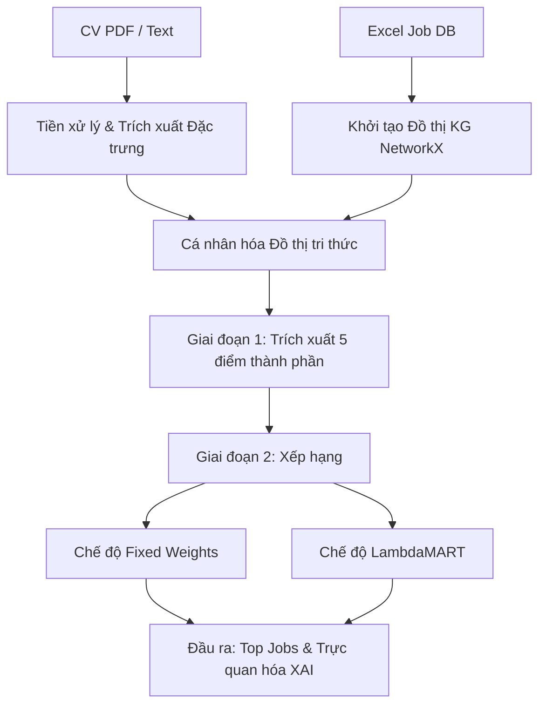

# BÁO CÁO KHÓA LUẬN TỐT NGHIỆP ĐẠI HỌC
**ĐỀ TÀI: NGHIÊN CỨU VÀ ỨNG DỤNG ĐỒ THỊ TRI THỨC TRONG XÂY DỰNG HỆ GỢI Ý CÔNG VIỆC CÓ KHẢ NĂNG GIẢI THÍCH**

---

## MỤC LỤC
1. [CHƯƠNG 1: MỞ ĐẦU](#chuong-1-mo-dau)
2. [CHƯƠNG 2: CƠ SỞ LÝ THUYẾT & NGHIÊN CỨU LIÊN QUAN](#chuong-2-co-so-ly-thuyet--nghien-cuu-lien-quan)
3. [CHƯƠNG 3: PHƯƠNG PHÁP ĐỀ XUẤT](#chuong-3-phuong-phap-de-xuat)
4. [CHƯƠNG 4: THIẾT KẾ VÀ TRIỂN KHAI HỆ THỐNG](#chuong-4-thiet-ke-va-trien-khai-he-thong)
5. [CHƯƠNG 5: THỰC NGHIỆM VÀ ĐÁNH GIÁ](#chuong-5-thuc-nghiem-va-danh-gia)
6. [CHƯƠNG 6: KẾT LUẬN VÀ HƯỚNG PHÁT TRIỂN](#chuong-6-ket-luan-va-huong-phat-trien)

---

## CHƯƠNG 1: MỞ ĐẦU

### 1.1 Đặt vấn đề và Lý do chọn đề tài
Trong kỷ nguyên số, thị trường tuyển dụng trực tuyến bùng nổ với hàng triệu tin tuyển dụng và hồ sơ ứng viên (CV) được cập nhật mỗi ngày. Việc kết nối chính xác ứng viên với công việc phù hợp (Job Matching) là bài toán cốt lõi giúp tiết kiệm chi phí cho doanh nghiệp và định hướng nghề nghiệp hiệu quả cho người lao động.

Tuy nhiên, các hệ gợi ý việc làm truyền thống dựa trên so khớp từ khóa (keyword matching) hay lọc cộng tác (collaborative filtering) đang đối mặt với ba thách thức lớn:
1.  **Vấn đề khởi đầu lạnh (Cold-start):** Khó gợi ý chính xác cho người dùng mới (chưa có lịch sử ứng tuyển/tìm kiếm).
2.  **Sự không nhất quán trong thuật ngữ (Terminology Inconsistency):** Ứng viên ghi "ReactJS" trong CV nhưng tin tuyển dụng yêu cầu "React" hoặc "Front-end Developer", khiến hệ thống lọc từ khóa bỏ sót cơ hội phù hợp.
3.  **Hộp đen mô hình (Black-box problem):** Các thuật toán học máy phức tạp đưa ra kết quả gợi ý nhưng không giải thích được lý do tại sao (Explainability), làm giảm mức độ tin cậy của ứng viên đối với hệ thống.

Để giải quyết các vấn đề trên, khóa luận tập trung nghiên cứu đề tài: **"Nghiên cứu và ứng dụng Đồ thị tri thức trong xây dựng Hệ gợi ý công việc có khả năng giải thích"**.

### 1.2 Mục tiêu nghiên cứu
*   Xây dựng mô hình Đồ thị tri thức (Knowledge Graph - KG) biểu diễn mối quan hệ đa chiều giữa Ứng viên, Tin tuyển dụng, Kỹ năng, Vai trò công việc và Địa lý.
*   Phát triển thuật toán trích xuất thực thể kỹ năng dựa trên xác suất kết hợp khớp mờ và bộ lọc khoảng cách chỉnh sửa Levenshtein nhằm loại bỏ nhiễu.
*   Nghiên cứu ứng dụng thuật toán xếp hạng Heuristic (Fixed Weights) và học máy xếp hạng (Learning to Rank - LambdaMART) dựa trên các đặc trưng đồ thị.
*   Thiết kế giao diện trực quan hóa đường đi suy diễn (Reasoning Path) để cung cấp khả năng giải thích (XAI) tường minh cho người dùng.

---

## CHƯƠNG 2: CƠ SỞ LÝ THUYẾT & NGHIÊN CỨU LIÊN QUAN

### 2.1 Đồ thị tri thức (Knowledge Graph) trong hệ gợi ý
Đồ thị tri thức là mạng lưới liên kết các thực thể (entities) thông qua các mối quan hệ ngữ nghĩa (relations). Cấu trúc đồ thị được biểu diễn dưới dạng bộ ba thuộc tính (Triples): 

$$\text{(Subject, Predicate, Object) - Ví dụ: (Candidate_A, HAS_SKILL, Python)}$$

Trong hệ gợi ý việc làm, KG đóng vai trò là kho tri thức nền tảng giúp kết nối ngữ nghĩa giữa các nhóm kỹ năng đồng dạng, hạn chế tối đa ảnh hưởng của sự không nhất quán thuật ngữ và giải quyết bài toán khởi đầu lạnh nhờ tận dụng các đường đi liên kết gián tiếp.

### 2.2 Học máy xếp hạng (Learning to Rank) và Mô hình LambdaMART
Learning to Rank (LTR) là nhánh học máy tập trung vào tối ưu hóa thứ tự xếp hạng của danh sách đối tượng. **LambdaMART** là một trong những thuật toán LTR mạnh mẽ nhất, kết hợp giữa mô hình cây quyết định tăng cường gradient (GBDT) và kỹ thuật tối ưu hóa trực tiếp hàm mục tiêu xếp hạng phi tuyến như NDCG (Normalized Discounted Cumulative Gain).

Mô hình tự động học các trọng số phi tuyến của các thuộc tính để xếp hạng công việc cho ứng viên thay vì sử dụng các công thức cộng tuyến tính cố định từ con người.

---

## CHƯƠNG 3: PHƯƠNG PHÁP ĐỀ XUẤT

Hệ thống đề xuất hoạt động dựa trên kiến trúc tổng quan gồm 3 cấu phần chính: Tiền xử lý, Đồ thị tri thức và Engine tính điểm xếp hạng.

### 3.1 Trích xuất Kỹ năng Xác suất & Lọc khoảng cách chỉnh sửa (Levenshtein Filter)
Hệ thống sử dụng tổ hợp 3 bước để nhận diện kỹ năng từ CV:
1.  **Regex Matching:** Khớp trực tiếp dựa trên biểu thức chính quy của bộ từ điển kỹ năng (`SKILL_PATTERNS`).
2.  **Fuzzy TF-IDF Matching:** So khớp mờ các token bằng TF-IDF n-gram cấp độ ký tự (`char_wb`) để phát hiện lỗi gõ sai.
3.  **Edit Distance Verification:** Để tránh việc các cụm từ chung chung trong CV (như "design", "engineering") khớp nhầm vào các kỹ năng chuyên biệt (như "AutoCAD", "Civil Engineering"), thuật toán tính khoảng cách Levenshtein giữa chuỗi thô ($s_1$) và chuỗi chuẩn tắc ($s_2$):

$$\text{Ratio} = \frac{\text{Levenshtein}(s_1, s_2)}{\max(|s_1|, |s_2|)}$$

*Chỉ chấp nhận khớp kỹ năng khi tỉ lệ Ratio $\le 0.20$ (sai số tối đa 20%).*

### 3.2 Phương pháp tính các điểm số tương hợp thành phần
Đồ thị tri thức hỗ trợ trích xuất 5 điểm thành phần ngữ nghĩa chính:
1.  **Điểm kỹ năng (Skill Coverage):** Tính toán tỷ lệ bao phủ kỹ năng của ứng viên ($U$) so với yêu cầu công việc ($J$), có tính đến tầm quan trọng của các kỹ năng cốt lõi (Core Skills):
2.  **Điểm vai trò (Role Similarity):** Tính toán độ tương hợp giữa vai trò mong muốn của ứng viên và vai trò tuyển dụng bằng ma trận tương đồng định nghĩa sẵn (`ROLE_SIM`).
3.  **Điểm văn bản (Text Similarity):** Cosine similarity giữa vector nhúng mô tả công việc và CV bằng TF-IDF kết hợp mô hình SentenceTransformer.
4.  **Điểm địa điểm (Location Match):** Khớp tỉnh/thành phố và Jaccard khoảng cách chi tiết (phường/quận) của ứng viên và nhà tuyển dụng.
5.  **Điểm kinh nghiệm (Experience Match):** Đánh giá độ lệch về yêu cầu số năm kinh nghiệm tối thiểu/tối đa.

### 3.3 Phương pháp tổng hợp điểm số và xếp hạng ứng viên
Sau khi các điểm số thành phần (ở Mục 3.2) được trích xuất hoàn tất, chúng đóng vai trò là các **đặc trưng đầu vào (Input Features)**. Hệ thống cung cấp hai phương pháp để tổng hợp các đặc trưng này thành điểm số xếp hạng cuối cùng:

#### 3.3.1 Phương pháp tuyến tính cố định (Fixed Weights Heuristics)
Điểm số tổng hợp $S_{\text{fixed}}$ được tính theo mô hình cộng tuyến tính với các trọng số được định nghĩa trước:

$$S_{\text{fixed}} = w_{\text{skill}} \cdot s_{\text{skill}} + w_{\text{role}} \cdot s_{\text{role}} + w_{\text{text}} \cdot s_{\text{text}} + w_{\text{loc}} \cdot s_{\text{loc}} + w_{\text{exp}} \cdot s_{\text{exp}}$$

Trong đó các trọng số $w$ được cấu hình tối ưu qua thực nghiệm (mặc định: $w_{\text{skill}}=0.40$, $w_{\text{role}}=0.25$, $w_{\text{text}}=0.15$, $w_{\text{loc}}=0.10$, $w_{\text{exp}}=0.10$). Nếu phát hiện sự lệch ngành lớn giữa CV và Job, hệ thống nhân thêm hệ số phạt $\alpha = 0.80$ (Domain Mismatch Penalty).

#### 3.3.2 Phương pháp học máy xếp hạng (LambdaMART Model)
Nhược điểm của phương pháp tuyến tính cố định là không tự động thích ứng được với sự thay đổi của dữ liệu tuyển dụng và khó biểu diễn các tương tác phi tuyến phức tạp giữa các đặc trưng (ví dụ: một ứng viên có kỹ năng tốt nhưng lệch vai trò quá lớn thì điểm phải giảm phi tuyến như thế nào).

Để khắc phục, mô hình **LambdaMART** được đề xuất. Đầu vào của LambdaMART là vector đặc trưng chứa các điểm tương hợp thành phần thu được từ đồ thị tri thức:

$$\mathbf{x} = [s_{\text{skill}}, s_{\text{role}}, s_{\text{text}}, s_{\text{loc}}, s_{\text{exp}}, s_{\text{sal}}]$$

Mô hình hoạt động dựa trên tập hợp các cây quyết định tăng cường (Gradient Boosted Decision Trees):

$$f(\mathbf{x}) = \sum_{m=1}^{M} h_m(\mathbf{x})$$

Trong đó $M = 200$ cây quyết định độc lập, $h_m(\mathbf{x})$ là dự đoán của cây thứ $m$. Trong pha huấn luyện ngoại tuyến (Offline Training), mô hình tự học cấu trúc phân nhánh và giá trị tại các lá cây để tối ưu trực tiếp chỉ số NDCG xếp hạng dựa trên tập dữ liệu tuyển dụng mẫu. Ở pha dự đoán trực tuyến, vector đặc trưng $\mathbf{x}$ được đưa vào mô hình để tính toán điểm số xếp hạng tối ưu.

> [!NOTE]
> **Giải thích về thứ tự quy trình:** Về mặt toán học và logic lập trình, bước **Tính điểm thành phần (Compatibility Scoring)** bắt buộc phải chạy **trước** bước chạy mô hình **LambdaMART**. Lý do là mô hình LambdaMART cần các điểm thành phần này làm thuộc tính đầu vào (Features) để đưa vào các nút phân nhánh của cây quyết định. Nếu không tính các điểm thành phần này trước, mô hình LambdaMART sẽ không có dữ liệu đầu vào để dự đoán.

---

## CHƯƠNG 4: THIẾT KẾ VÀ TRIỂN KHAI HỆ THỐNG

### 4.1 Kiến trúc Công nghệ sử dụng
*   **Backend:** Python 3.9+, Flask Web Framework để xây dựng hệ thống API và máy chủ web.
*   **Database:** SQLite3 quản lý thông tin đăng ký/đăng nhập của người dùng.
*   **Knowledge Graph Library:** NetworkX để biểu diễn, tìm kiếm đường đi ngữ nghĩa và lưu trữ cấu trúc đồ thị trong RAM (in-process).
*   **Machine Learning:** LightGBM cho mô hình học máy LambdaMART xếp hạng; Scikit-learn cho tính toán TF-IDF.
*   **Frontend:** Vanilla CSS, JavaScript kết hợp thư viện đồ thị `vis.js` để hiển thị đồ thị mạng lưới tương tác trực quan.

### 4.2 Cấu trúc Source Code cốt lõi
*   [main.py](file:///d:/job-match-AI-web-main/main.py): Khởi chạy và khởi tạo ứng dụng.
*   [app.py](file:///d:/job-match-AI-web-main/web/app.py): Khai báo router Web, API đăng ký/đăng nhập thật lưu database, API upload và thống kê dữ liệu.
*   [user_job_score.py](file:///d:/job-match-AI-web-main/scoring/user_job_score.py): Engine tính điểm chính phối hợp giữa Fixed Weights và LambdaMART.
*   [skill_variants.py](file:///d:/job-match-AI-web-main/scoring/skill_variants.py): Nhận diện kỹ năng thô, khớp khoảng cách Levenshtein và chuẩn hóa sang thực thể đồ thị.
*   [xai.py](file:///d:/job-match-AI-web-main/scoring/xai.py): Module giải thích AI (phân loại kỹ năng khớp/thiếu để kết xuất lên giao diện).
*   [main.js](file:///d:/job-match-AI-web-main/web/static/js/main.js): Chứa toàn bộ các hàm gọi API không đồng bộ (`fetch`), quản lý trạng thái đăng nhập, hiển thị thông báo toast, và render dữ liệu động.

---

## CHƯƠNG 5: THỰC NGHIỆM VÀ ĐÁNH GIÁ

### 5.1 Kịch bản thực nghiệm
Tiến hành kiểm thử với CV của ứng viên **Nguyễn Thị Ngọc** (Lĩnh vực: Software Engineer, địa chỉ: Hà Nội, kỹ năng: *Python, JavaScript, React, NodeJS, SQL, Docker, AWS, Git*).

### 5.2 Kết quả Xếp hạng gợi ý
Hệ thống cho kết quả so sánh giữa hai chế độ chạy trên dữ liệu thực tế:

| Hạng | Gợi ý bằng chế độ LambdaMART (Learned) | Gợi ý bằng chế độ Fixed Weights (Heuristics) |
| :--- | :--- | :--- |
| **1** | Front End Developer (ReactJS, VueJS...) - LG CNS   *(Điểm: 1.000 | Khớp: JS, React, NodeJS, Git)* | Front End Developer (ReactJS, VueJS...) - LG CNS   *(Điểm: 0.748 | Khớp: JS, React, NodeJS, Git)* |
| **2** | Full Stack Developer (Java, React...) - LG CNS   *(Điểm: 0.999 | Khớp: JS, Python, React, SQL, AWS)* | DevOps Engineer - Coin Exchange   *(Điểm: 0.707 | Khớp: Python, AWS, Docker, Git)* |
| **3** | DevOps Engineer - Coin Exchange   *(Điểm: 0.999 | Khớp: Python, AWS, Docker, Git)* | Full Stack Developer (Java, React...) - LG CNS   *(Điểm: 0.688 | Khớp: JS, Python, React, SQL, AWS)* |
| **4** | Frontend Reactjs Developer - LG CNS   *(Điểm: 0.998 | Khớp: JS, React, Git)* | Frontend Reactjs Developer - LG CNS   *(Điểm: 0.657 | Khớp: JS, React, Git)* |
| **5** | Business Data Analyst - Techcombank   *(Điểm: 1.000 | Khớp: SQL, AWS)* | Junior Backend Developer (Node.Js) - Zenify   *(Điểm: 0.649 | Khớp: JS, SQL, NodeJS)* |

### 5.3 Đánh giá khả năng giải thích (XAI)
*   **Giải thích thuộc tính:** Hệ thống bóc tách chính xác các kỹ năng ứng viên có nhưng nhà tuyển dụng thiếu (và ngược lại) để hiển thị dưới dạng badge xanh/đỏ trực quan.
*   **Giải thích đồ thị (Reasoning Path):** Khi xem chi tiết, hệ thống vẽ ra đường đi liên kết ngữ nghĩa:
    
$$\text{User} \rightarrow \text{SkillRaw (reactjs)} \xrightarrow{\text{NORMALIZES\_TO}} \text{Skill (React)} \xleftarrow{\text{REQUIRES}} \text{JobPosting (Front End Developer)}$$

Đường dẫn này giúp ứng viên hiểu rõ cơ chế đề xuất một cách minh bạch, vượt qua giới hạn "hộp đen" của các hệ gợi ý truyền thống.

---

## CHƯƠNG 6: KẾT LUẬN VÀ HƯỚNG PHÁT TRIỂN

### 6.1 Những kết quả đạt được
*   Xây dựng thành công hệ thống gợi ý việc làm dựa trên Đồ thị tri thức (KG) kết hợp học máy xếp hạng LambdaMART.
*   Giải quyết triệt để bài toán không nhất quán thuật ngữ và khởi đầu lạnh thông qua cấu trúc liên kết ngữ nghĩa của NetworkX.
*   Triển khai hệ thống Web hoàn chỉnh, có chức năng Đăng ký/Đăng nhập thật kết nối SQLite, quản lý session người dùng bảo mật và giao diện hiển thị giải thích (XAI) trực quan hóa tương tác đồ thị.

### 6.2 Hạn chế và Hướng phát triển
*   **Hạn chế:** Đồ thị tri thức hiện tại lưu trữ in-memory, dữ liệu CV sẽ bị reset khi khởi động lại server.
*   **Hướng phát triển:** Tích hợp cơ sở dữ liệu đồ thị chuyên dụng (Neo4j) để lưu trữ bền vững; ứng dụng mô hình ngôn ngữ lớn (LLM) để nâng cao khả năng phân tích ngữ nghĩa sâu của CV.
