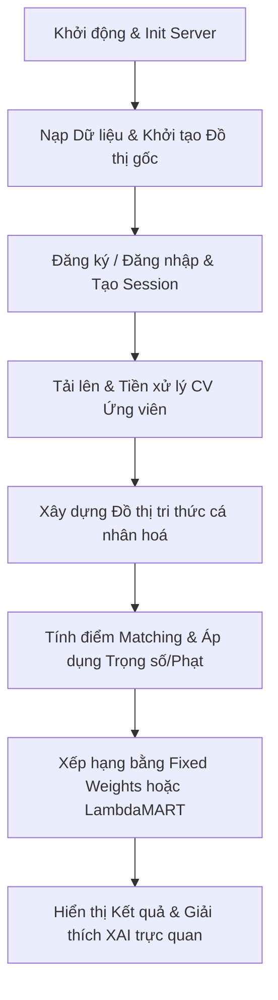

# TÀI LIỆU KIẾN TRÚC VÀ QUY TRÌNH HỆ THỐNG (JOB MATCH AI WEB)
> *Tài liệu tổng hợp phục vụ báo cáo và bảo vệ đồ án tốt nghiệp VKU*
> *Đề tài: "Nghiên cứu và ứng dụng Đồ thị tri thức trong xây dựng Hệ gợi ý công việc có khả năng giải thích"*

---

## 1. TỔNG QUAN HỆ THỐNG
Hệ thống **Job Match AI Web** là sự kết hợp giữa **Đồ thị tri thức (Knowledge Graph - KG)** và các phương pháp chấm điểm tương thích (gồm hệ số tuyến tính Heuristics và mô hình học máy LambdaMART) nhằm đưa ra kết quả gợi ý việc làm chính xác, đồng thời cung cấp khả năng giải thích (XAI) minh bạch cho ứng viên.

### Sơ đồ quy trình tổng quan


---

## 2. BẢN ĐỒ KIẾN TRÚC MÃ NGUỒN (DIRECTORY STRUCTURE)

Dưới đây là sơ đồ thư mục và vai trò của các file cốt lõi trong codebase:

```
job-match-AI-web-main/
  ├── main.py                    # Điểm chạy chính của toàn bộ hệ thống
  ├── config.py                  # Cấu hình hệ thống (trọng số, từ điển kỹ năng, hệ số phạt...)
  ├── requirements.txt           # Danh sách thư viện Python cần thiết
  ├── merged_jobs.xlsx           # Database 996 tin tuyển dụng thu thập từ TopCV
  │
  ├── web/                       # Phân hệ Web (Flask Backend & Frontend)
  │     ├── app.py               # Flask Backend: Định nghĩa toàn bộ Router & API Endpoints
  │     ├── migrations.py        # Quản lý cấu trúc bảng SQLite3 (users, resets)
  │     ├── data/
  │     │     └── app.db         # Cơ sở dữ liệu SQLite3 lưu tài khoản & phiên làm việc
  │     ├── static/js/main.js    # Logic Frontend chính (gọi API, render kết quả, dynamic UI)
  │     └── templates/           # Giao diện HTML (Jinja2 Templates)
  │
  ├── scoring/                   # Phân hệ Tính điểm & Gợi ý (Matching Engine)
  │     ├── user_job_score.py    # Xử lý tính điểm tương hợp tổng hợp (Composite Match Score)
  │     ├── skill_variants.py    # Trích xuất kỹ năng bằng phương pháp xác suất & bộ lọc Levenshtein
  │     ├── weight_learner.py    # Huấn luyện và dự đoán điểm xếp hạng bằng LambdaMART (LightGBM)
  │     └── xai.py               # Giải thích AI (phân loại kỹ năng khớp/thiếu)
  │
  ├── kg/                        # Phân hệ Đồ thị tri thức (Knowledge Graph)
  │     ├── graph_init.py        # Khởi tạo đồ thị NetworkX DiGraph dạng RDF
  │     ├── job_builder.py       # Xây dựng các Node Job và liên kết kỹ năng yêu cầu
  │     ├── user_builder.py      # Xây dựng Node User và liên kết kỹ năng ứng viên
  │     └── similarity.py        # Thiết lập liên kết tương đồng (SIMILAR_TO) giữa các công việc
  │
  ├── utils/                     # Phân hệ Tiền xử lý & Trợ giúp
  │     ├── data_loader.py       # Nạp file Excel tuyển dụng và phân tích văn bản CV PDF/OCR
  │     └── text_processing.py   # Chuẩn hóa tiếng Việt, trích xuất vai trò, địa điểm, kinh nghiệm
  │
  └── scratch/                   # Các kịch bản chạy thử nghiệm
        └── test_matching.py     # Script kiểm thử độ chính xác thuật toán matching ở cả 2 chế độ
```

---

## 3. QUY TRÌNH HỆ THỐNG 8 BƯỚC CHI TIẾT (SYSTEM PIPELINE)

### Bước 1: Khởi động & Khởi tạo Phân hệ Web
*   **Mã nguồn:** [main.py](file:///d:/job-match-AI-web-main/main.py) $\rightarrow$ [app.py](file:///d:/job-match-AI-web-main/web/app.py)
*   **Hoạt động:** Khi khởi chạy server qua `python main.py`, hệ thống thực hiện khởi tạo Flask App, đồng thời tự động chạy migrations để thiết lập cơ sở dữ liệu SQLite (`data/app.db`) với các bảng `users` và `password_resets`.

### Bước 2: Khởi tạo Đồ thị tri thức gốc (KG Initialization)
*   **Mã nguồn:** [graph_init.py](file:///d:/job-match-AI-web-main/kg/graph_init.py), [job_builder.py](file:///d:/job-match-AI-web-main/kg/job_builder.py), [similarity.py](file:///d:/job-match-AI-web-main/kg/similarity.py)
*   **Hoạt động:** 
    1. Hệ thống đọc file dữ liệu tuyển dụng [merged_jobs.xlsx](file:///d:/job-match-AI-web-main/merged_jobs.xlsx) qua [data_loader.py](file:///d:/job-match-AI-web-main/utils/data_loader.py).
    2. Tạo lập các Node loại `JobPosting` trên đồ thị NetworkX.
    3. Trích xuất và chuẩn hóa kỹ năng yêu cầu của tin tuyển dụng thành các node chuẩn `Skill` kết nối với `JobPosting`.
    4. Tính toán độ tương hợp ngữ nghĩa nội dung giữa các tin tuyển dụng để dựng nên các cạnh liên kết `SIMILAR_TO` giữa các job.

### Bước 3: Xác thực tài khoản & Phân tách Session
*   **Mã nguồn:** [app.py](file:///d:/job-match-AI-web-main/web/app.py#L76), [main.js](file:///d:/job-match-AI-web-main/web/static/js/main.js#L83)
*   **Hoạt động:** Người dùng tương tác qua giao diện để Đăng ký, Đăng nhập hoặc Quên/Đặt lại mật khẩu. Backend xác thực thông tin tài khoản qua SQLite, băm mật khẩu bảo mật (PBKDF2 SHA256) và cấp Session UUID cho từng người dùng, đảm bảo dữ liệu đồ thị tri thức cá nhân không bị xung đột giữa nhiều người dùng trực tuyến song song.

### Bước 4: Tải lên CV & Tiền xử lý văn bản (CV Parsing)
*   **Mã nguồn:** [data_loader.py](file:///d:/job-match-AI-web-main/utils/data_loader.py#L24), [text_processing.py](file:///d:/job-match-AI-web-main/utils/text_processing.py)
*   **Hoạt động:** 
    1. Khi tải lên CV PDF, hệ thống dùng `pdfplumber` (hoặc OCR qua Tesseract) trích xuất toàn bộ text văn bản.
    2. Hàm `split_cv_sections` phân tách CV thành các phần (Skills, Exp, Edu).
    3. Hàm `norm_text` chuẩn hóa chuỗi (chuyển chữ thường, loại bỏ dấu tiếng Việt, ký tự đặc biệt).
    4. Nhận diện địa lý ứng viên (`parse_location_city_detail`), số năm kinh nghiệm (`parse_year_range`) và chuyển đổi sang các nhóm kinh nghiệm chuẩn hóa (`Exp_0_1`, `Exp_1_3`, `Exp_3_5`, `Exp_5_plus`).

### Bước 5: Trích xuất kỹ năng bằng xác suất và Bộ lọc khoảng cách chỉnh sửa
*   **Mã nguồn:** [skill_variants.py](file:///d:/job-match-AI-web-main/scoring/skill_variants.py#L85)
*   **Hoạt động:** 
    1. Nhận diện kỹ năng trực tiếp qua Regex từ điển (`SKILL_PATTERNS`).
    2. Thực hiện khớp mờ (Fuzzy match) bằng TF-IDF n-gram cấp độ ký tự (`char_wb`).
    3. **Bộ lọc Levenshtein:** Chạy hàm `_is_valid_fuzzy_match` đo khoảng cách chỉnh sửa. Nếu tỉ lệ chỉnh sửa $> 20\%$, loại bỏ ngay kỹ năng để tránh trường hợp nhận diện sai (ví dụ: khớp từ chung chung "design" thành kỹ năng chuyên sâu "AutoCAD").
    4. Nhận diện lĩnh vực chuyên môn (Domain Detection) của văn bản CV để tự động tăng xác suất các kỹ năng cùng ngành và triệt tiêu bớt các kỹ năng trái ngành.

### Bước 6: Cá nhân hóa Đồ thị tri thức (Personalized Graph Construction)
*   **Mã nguồn:** [user_builder.py](file:///d:/job-match-AI-web-main/kg/user_builder.py)
*   **Hoạt động:** 
    1. Tạo Node loại `User` đại diện ứng viên.
    2. Tạo Node kỹ năng thô (`SkillRaw`) nối với Node `User`.
    3. Thiết lập các cạnh `NORMALIZES_TO` từ các node kỹ năng thô `SkillRaw` đến các node kỹ năng chuẩn tắc `Skill` tương ứng trên đồ thị.
    4. Nối Node `User` đến node địa lý của ứng viên thông qua cạnh `LIVES_IN`.

### Bước 7: Tính toán Điểm số tương thích (Similarity Scoring)
*   **Mã nguồn:** [user_job_score.py](file:///d:/job-match-AI-web-main/scoring/user_job_score.py), [config.py](file:///d:/job-match-AI-web-main/config.py)
*   **Hoạt động:** Quy trình tính điểm gồm **2 giai đoạn** rõ ràng:

#### Giai đoạn 7.1: Trích xuất các điểm thành phần (Component Scores)
Trước khi ra điểm số cuối cùng, hệ thống luôn trích xuất và tính toán các điểm số thành phần độc lập của cặp ứng viên - công việc:
1.  **Điểm Kỹ năng (Skill Coverage):** Độ bao phủ kỹ năng của ứng viên so với công việc trên Đồ thị tri thức (kỹ năng cốt lõi nhân đôi trọng số).
2.  **Điểm Vai trò (Role Similarity):** Độ tương đồng của vai trò mong muốn và vai trò công việc.
3.  **Điểm Ngữ nghĩa văn bản (Text Similarity):** Cosine similarity của mô tả công việc và CV bằng TF-IDF / SentenceTransformer.
4.  **Điểm Địa điểm (Location Match):** So khớp tỉnh/thành phố và Jaccard quận/huyện.
5.  **Điểm Kinh nghiệm (Experience Match):** Độ khớp khoảng năm kinh nghiệm yêu cầu.

#### Giai đoạn 7.2: Tính tổng điểm xếp hạng (1 trong 2 chế độ cấu hình tùy chọn)
Tùy thuộc vào thiết lập `USE_LAMBDAMART` trong file cấu hình, hệ thống sẽ sử dụng một trong hai phương án sau để xếp hạng:
*   **PHƯƠNG ÁN A: Chế độ Fixed Weights (Hệ số tuyến tính Heuristics):**
    *   Lấy các điểm thành phần nhân trực tiếp với trọng số cố định định nghĩa trong `config.py` (ví dụ: Skill 40%, Role 25%, Text 15%, Loc 10%, Exp 10%).
    *   Áp dụng phạt lệch ngành (`DOMAIN_MISMATCH_PENALTY = 0.80`) nếu CV chuyên biệt ứng tuyển trái ngành.
*   **PHƯƠNG ÁN B: Chế độ LambdaMART (Mô hình Học máy):**
    *   Lấy các điểm thành phần thu được từ Giai đoạn 7.1 làm **Đặc trưng đầu vào (Features)**.
    *   Đưa các đặc trưng này qua mô hình LightGBM LambdaRank (`_LAMBDAMART_MODEL`) để dự đoán và xếp hạng mức độ phù hợp tối ưu (mô hình tự học các trọng số phi tuyến phức tạp thay vì nhân cộng tuyến tính).


### Bước 8: Gợi ý và Lý giải kết quả trực quan (XAI)
*   **Mã nguồn:** [xai.py](file:///d:/job-match-AI-web-main/scoring/xai.py), [graph_visualization.js](file:///d:/job-match-AI-web-main/web/static/js/main.js) (phần render đồ thị)
*   **Hoạt động:** 
    1. Giao diện hiển thị Top công việc phù hợp nhất.
    2. Hàm `explain_user_job` bóc tách chi tiết các kỹ năng trùng khớp (**Matched Skills**) và kỹ năng còn thiếu (**Missing Skills**).
    3. Hệ thống vẽ lát cắt đồ thị nhỏ thể hiện các quan hệ: `User` $\rightarrow$ `SkillRaw` $\rightarrow$ `Skill` $\leftarrow$ `JobPosting` làm đường suy diễn giải thích trực quan (Reasoning Path) tại sao công việc này lại phù hợp với ứng viên.

---

## 4. ĐỐI CHIẾU SLIDE THUYẾT TRÌNH BẢO VỆ VÀ CODEBASE THỰC TẾ (VKU SLIDES MAPPING)

Bảng đối chiếu phục vụ cho hội đồng chấm khóa luận tốt nghiệp:

| Nội dung trên Slide tốt nghiệp | Component / File Code | Phương thức triển khai trong Mã nguồn |
| :--- | :--- | :--- |
| **Slide 3: Proposed Methodology** <br>*(Quy trình trích xuất đặc trưng)* | [skill_variants.py](file:///d:/job-match-AI-web-main/scoring/skill_variants.py#L85) <br> [text_processing.py](file:///d:/job-match-AI-web-main/utils/text_processing.py) | Trích xuất kỹ năng bằng phương pháp xác suất (`extract_skills_probabilistic`). Nhận diện vai trò (`infer_role_canonical`), địa điểm (`parse_location_city_detail`) và kinh nghiệm ứng viên. |
| **Knowledge Graph Construction** <br>*(Xây dựng Đồ thị tri thức)* | Thư mục [kg/](file:///d:/job-match-AI-web-main/kg/) | Khởi tạo cấu trúc đồ thị NetworkX DiGraph dạng RDF (`graph_init.py`). Xây dựng thực thể Job (`job_builder.py`), User (`user_builder.py`) và các liên kết tương đồng `SIMILAR_TO` giữa các Job (`similarity.py`). |
| **Similarity Scoring** <br>*(Tính toán điểm tương đồng)* | [user_job_score.py](file:///d:/job-match-AI-web-main/scoring/user_job_score.py) | Kết hợp điểm bao phủ kỹ năng (Skill coverage), độ tương đồng văn bản TF-IDF, khoảng cách địa lý và kinh nghiệm bằng hệ số tuyến tính hoặc mô hình học máy LambdaMART (`scoring/weight_learner.py`). |
| **Explainable Feedback** <br>*(Giải thích kết quả gợi ý)* | [xai.py](file:///d:/job-match-AI-web-main/scoring/xai.py) <br> `web/templates/pages/graph.html` | Sinh ra các bằng chứng giải thích lý do khớp/thiếu kỹ năng (`explain_user_job`). Trực quan hóa đường đi suy diễn (Reasoning Path) trên giao diện bằng thư viện `vis.js`. |
| **Slide 3.1.1: Data Collection** <br>*(Thu thập dữ liệu Job)* | [data_loader.py](file:///d:/job-match-AI-web-main/utils/data_loader.py#L10) | Đọc dữ liệu từ bảng tính Excel đã thu thập (`merged_jobs.xlsx`) thông qua pandas để nạp vào hệ thống. |
| **Slide 3.1.2: Data Preprocessing** <br>*(Tiền xử lý và chuẩn hóa)* | [text_processing.py](file:///d:/job-match-AI-web-main/utils/text_processing.py#L11) <br> [skill_variants.py](file:///d:/job-match-AI-web-main/scoring/skill_variants.py#L200) | Chuẩn hóa văn bản tiếng Việt/Anh (`norm_text`), phân đoạn CV (`split_cv_sections`), băm định danh node (`sid`), và ánh xạ từ các biến thể từ đồng nghĩa (aliases) về kỹ năng chuẩn tắc (Ontology Mapping). |

---

## 5. HƯỚNG DẪN CHẠY DỰ ÁN VÀ THỬ NGHIỆM LÂM SÀNG (HOW TO RUN)

### Khởi động Server
Chạy lệnh sau tại thư mục gốc của dự án:
```bash
python main.py
```
*Server sẽ chạy tại địa chỉ mặc định `http://127.0.0.1:5000`.*

### Thực hiện Thử nghiệm kiểm tra luồng
1.  **Đăng ký tài khoản:** Bấm vào nút Đăng ký trên thanh navbar, nhập Email đúng định dạng và mật khẩu mới để tạo tài khoản thật lưu vào SQLite database.
2.  **Đăng nhập hệ thống:** Sử dụng tài khoản vừa tạo để đăng nhập. Avatar trên cùng bên phải tự động cập nhật chữ cái đầu trong tên người dùng.
3.  **Tải CV ứng viên:** Tải file CV PDF lên hệ thống để xem gợi ý việc làm chính xác tương hợp nhất với thông tin ngành nghề và địa lý của ứng viên.
4.  **Xem Đồ thị tri thức giải thích:** Điều hướng tới trang Đồ thị tri thức để theo dõi các Reasoning Path lý giải chi tiết đường kết nối ứng viên và tin tuyển dụng.
